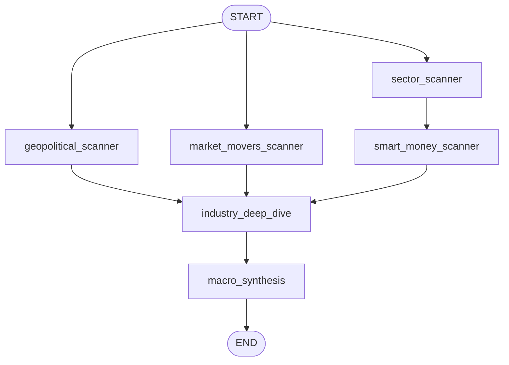
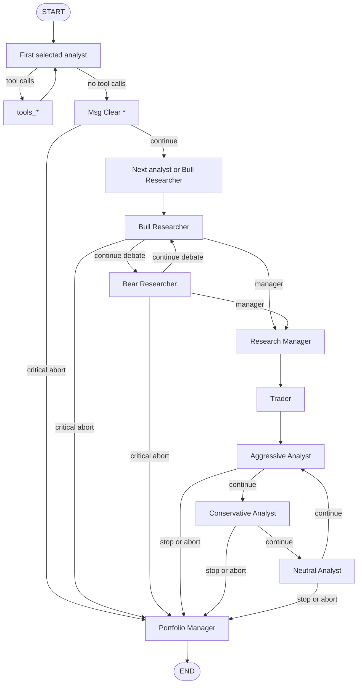
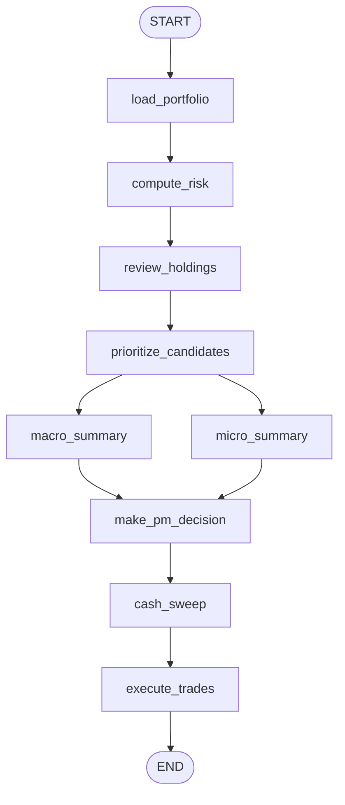

# TradingAgents graph flows

This document describes the current execution flows in TradingAgents as implemented in code on `main`.
It is intentionally derived from the graph builders and CLI entrypoints instead of copying long prompt bodies into the docs.
The source of truth is:

- `tradingagents/graph/scanner_graph.py`
- `tradingagents/graph/scanner_setup.py`
- `tradingagents/graph/trading_graph.py`
- `tradingagents/graph/setup.py`
- `tradingagents/graph/conditional_logic.py`
- `tradingagents/graph/portfolio_graph.py`
- `tradingagents/graph/portfolio_setup.py`
- `cli/main.py`

## 1. `scan` — macro scanner

`ScannerGraph` builds a fixed 4-phase macro scan.



### Node roles

| Node | Purpose | Source |
| --- | --- | --- |
| `geopolitical_scanner` | Global macro, policy, sanctions, conflict scan | `tradingagents/agents/scanners/geopolitical_scanner.py` |
| `market_movers_scanner` | Top movers, activity, index breadth | `tradingagents/agents/scanners/market_movers_scanner.py` |
| `sector_scanner` | Sector rotation and momentum ranking | `tradingagents/agents/scanners/sector_scanner.py` |
| `smart_money_scanner` | Insider buying, unusual volume, breakout accumulation | `tradingagents/agents/scanners/smart_money_scanner.py` |
| `industry_deep_dive` | Sector follow-up research after phase 1 | `tradingagents/agents/scanners/industry_deep_dive.py` |
| `macro_synthesis` | Final JSON macro summary and ticker shortlist | `tradingagents/agents/scanners/macro_synthesis.py` |

### Routing notes

- `geopolitical_scanner`, `market_movers_scanner`, and `sector_scanner` fan out from `START` in parallel.
- `smart_money_scanner` runs only after `sector_scanner` so it can use sector-rotation context.
- `industry_deep_dive` is the fan-in point and waits for all phase-1 predecessors.
- `macro_synthesis` is the final node and writes `macro_scan_summary`.

## 2. `pipeline` — per-ticker trading graph

`TradingAgentsGraph` builds the per-ticker graph from a selectable analyst prefix plus fixed downstream phases.

### Full graph



### Analyst phase

The analyst prefix is built dynamically from `selected_analysts`.
Supported analyst keys are:

- `market`
- `social`
- `news`
- `fundamentals`

For every selected analyst, the graph adds three nodes:

1. `<Analyst> Analyst`
2. `tools_<analyst>`
3. `Msg Clear <Analyst>`

The per-analyst conditional function lives in `tradingagents/graph/conditional_logic.py`:

- if the last LLM message includes tool calls, route to the matching `tools_*` node
- otherwise route to the matching `Msg Clear *` node

### Critical-abort routing

The current graph has two critical-abort shortcuts and they both matter:

1. After each analyst clear step, `GraphSetup._should_short_circuit_to_portfolio_manager()` checks `market_report` and `fundamentals_report`.
2. Debate and risk routing also check for `[CRITICAL ABORT]` in those reports inside `ConditionalLogic`.

That means the current pipeline can bypass the rest of the analyst sequence, the research debate, and the trader/risk loop and jump directly to `Portfolio Manager`.

### Debate and risk loops

- Debate loop:
  - `Bull Researcher` ↔ `Bear Researcher`
  - exits to `Research Manager` after the configured round cap
  - can also jump directly to `Portfolio Manager` on critical abort
- Trading/risk loop:
  - `Research Manager` → `Trader` → `Aggressive Analyst`
  - `Aggressive Analyst` → `Conservative Analyst` → `Neutral Analyst` → back to `Aggressive Analyst`
  - exits to `Portfolio Manager` after the configured round cap
  - can also jump directly to `Portfolio Manager` on critical abort

### Pipeline node sources

| Node group | Source |
| --- | --- |
| Market analyst | `tradingagents/agents/analysts/market_analyst.py` |
| Social analyst | `tradingagents/agents/analysts/social_media_analyst.py` |
| News analyst | `tradingagents/agents/analysts/news_analyst.py` |
| Fundamentals analyst | `tradingagents/agents/analysts/fundamentals_analyst.py` |
| Bull researcher | `tradingagents/agents/researchers/bull_researcher.py` |
| Bear researcher | `tradingagents/agents/researchers/bear_researcher.py` |
| Research manager | `tradingagents/agents/managers/research_manager.py` |
| Trader | `tradingagents/agents/trader/trader.py` |
| Aggressive / neutral / conservative risk debaters | `tradingagents/agents/risk_mgmt/` |
| Portfolio manager | `tradingagents/agents/managers/portfolio_manager.py` |

### Checkpoint subgraphs

`TradingAgentsGraph` also exposes two smaller compiled subgraphs:

- `debate_graph`: starts at `Bull Researcher` and skips analysts
- `risk_graph`: starts at `Aggressive Analyst` and skips analysts, debate, and trader

These are built by `GraphSetup.build_debate_subgraph()` and `GraphSetup.build_risk_subgraph()`.

## 3. `portfolio` — portfolio manager graph

`PortfolioGraph` builds a fixed portfolio-management workflow with a parallel summary fan-out.



### Node roles

| Node | Purpose | Source |
| --- | --- | --- |
| `load_portfolio` | Load portfolio and holdings from storage | closure in `tradingagents/graph/portfolio_setup.py` |
| `compute_risk` | Compute portfolio risk metrics from holdings and histories | closure in `tradingagents/graph/portfolio_setup.py` |
| `review_holdings` | LLM review of existing positions | `tradingagents/agents/portfolio/holding_reviewer.py` |
| `prioritize_candidates` | Rank scanner candidates against the current book | closure in `tradingagents/graph/portfolio_setup.py` |
| `macro_summary` | Summarize macro memory context | `tradingagents/agents/portfolio/macro_summary_agent.py` |
| `micro_summary` | Summarize reflexion / micro memory context | `tradingagents/agents/portfolio/micro_summary_agent.py` |
| `make_pm_decision` | Produce final buy/sell/hold decisions | `tradingagents/agents/portfolio/pm_decision_agent.py` |
| `cash_sweep` | Automatically sweep excess cash into `SGOV` | closure in `tradingagents/graph/portfolio_setup.py` |
| `execute_trades` | Execute decisions and persist trade results | closure in `tradingagents/graph/portfolio_setup.py` |

### Routing notes

- `macro_summary` and `micro_summary` run in parallel after candidate prioritization.
- `make_pm_decision` is the fan-in node for both summary branches.
- `cash_sweep` is a mandatory tail step after PM decisions.
- `execute_trades` is always last.

## 4. `auto` — CLI orchestration flow

`auto` is not a separate LangGraph graph. It is a CLI orchestration path in `cli/main.py`.

```mermaid
flowchart TD
    A[auto()] --> B[run_scan]
    B --> C[load current portfolio holdings]
    C --> D[build extra pipeline candidates from holdings]
    D --> E[run_pipeline]
    E --> F[run_portfolio]
```

### Execution notes

- `run_scan()` writes `scan_summary.json` under the daily market directory.
- `auto()` then loads current holdings and converts them into extra pipeline candidates so existing positions receive fresh per-ticker analysis.
- `run_pipeline()` consumes the scan summary plus any holding-derived candidates.
- `run_portfolio()` finally consumes the same `scan_summary.json` and current prices to produce portfolio decisions and trade execution.

## 5. Maintenance guidance

If these flows change, update the docs from the graph builders first, not from prompt dumps or UI output.
The safest review checklist is:

1. confirm node names in the relevant `*setup.py` file
2. confirm conditional routes in `tradingagents/graph/conditional_logic.py`
3. confirm orchestration order in `cli/main.py`
4. update this document only after the code path is settled
