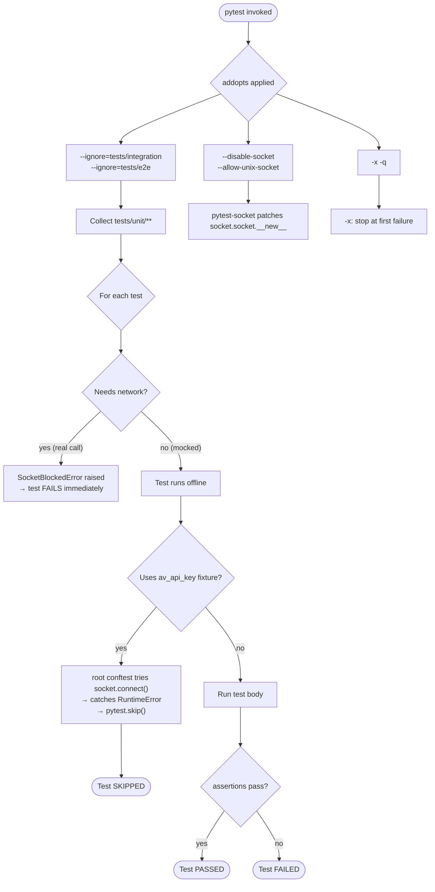
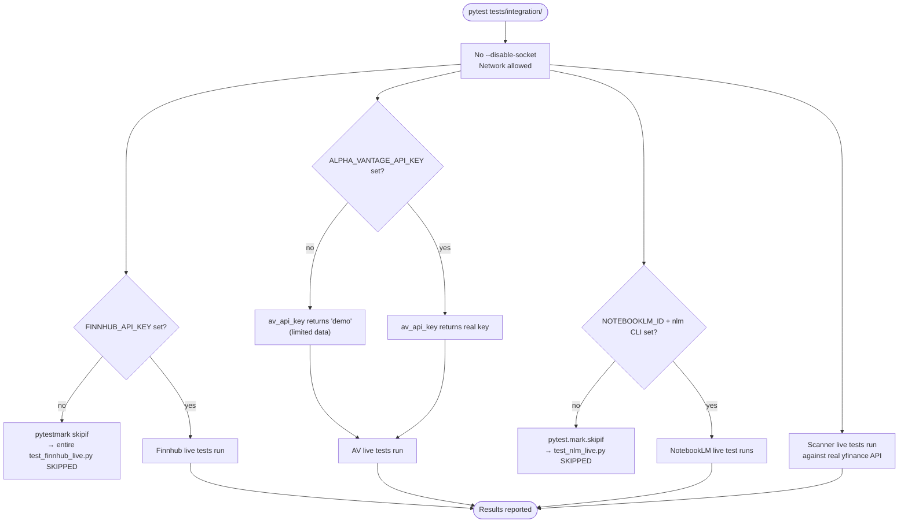
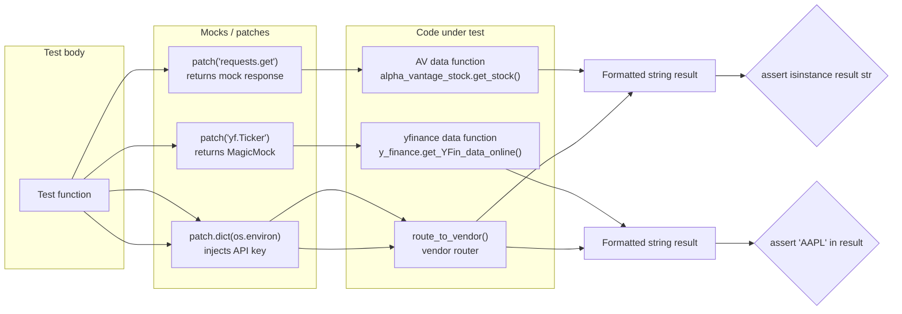
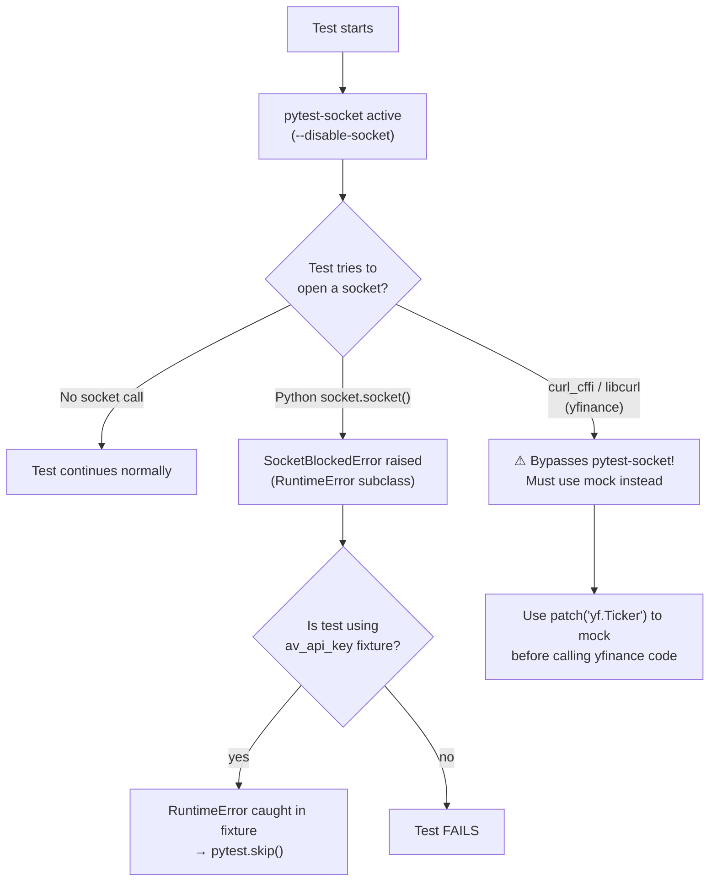
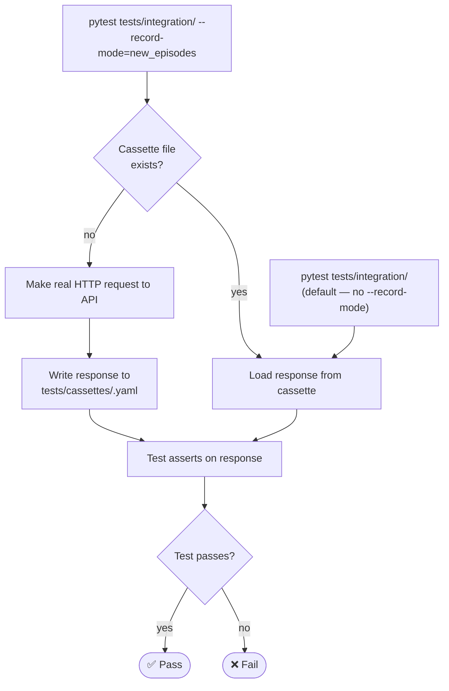

# TradingAgents — Test Suite Reference

> **Last verified:** 2026-03-19  
> **Test counts (current):** 405 unit · 68 integration · 1 e2e

---

## Table of Contents

1. [Overview](#overview)
2. [Three-Tier Architecture](#three-tier-architecture)
3. [Libraries and Tools](#libraries-and-tools)
4. [Fixtures Reference](#fixtures-reference)
5. [Markers Reference](#markers-reference)
6. [Test File Catalogue](#test-file-catalogue)
7. [Execution Flow Diagrams](#execution-flow-diagrams)
8. [How to Run Tests](#how-to-run-tests)
9. [Mock Patterns](#mock-patterns)
10. [Adding New Tests — Checklist](#adding-new-tests--checklist)

---

## Overview

The test suite enforces a strict **network isolation** policy: the default `pytest` run
(used in CI) **cannot make any real socket connections**.  Tests that need live APIs are
placed in separate directories and are *excluded from the default run* via `addopts` in
`pyproject.toml`.

```
tests/
├── conftest.py              ← root fixtures (shared across all tiers)
├── unit/                    ← offline, <5 s total, default run
│   ├── conftest.py          ← mock factories (yfinance, AV, LLM)
│   └── test_*.py
├── integration/             ← live APIs, excluded from default run
│   ├── conftest.py          ← VCR config + live key fixtures
│   └── test_*.py
├── e2e/                     ← real LLM pipeline, manual only
│   ├── conftest.py
│   └── test_*.py
└── cassettes/               ← recorded HTTP responses (VCR)
```

---

## Three-Tier Architecture

| Tier | Directory | Default run? | Network? | Speed | Purpose |
|------|-----------|:---:|:---:|-------|---------|
| **Unit** | `tests/unit/` | ✅ yes | ❌ blocked by `pytest-socket` | < 5 s | Validate logic, parsing, routing with mocks |
| **Integration** | `tests/integration/` | ❌ ignored | ✅ real APIs | seconds–minutes | Validate vendor API contracts, live data shapes |
| **E2E** | `tests/e2e/` | ❌ ignored | ✅ real LLM + APIs | minutes | Validate the full multi-agent pipeline |

### Why three tiers?

- **Fast feedback loop** — developers get a pass/fail signal in under 5 seconds on every commit.
- **No flaky CI** — CI never fails due to API rate limits, network timeouts, or key rotation.
- **Live API contract tests** — integration tests confirm the real API shape hasn't drifted from mocks.
- **Full pipeline validation** — e2e tests confirm all agents wire together correctly end-to-end.

---

## Libraries and Tools

### pytest `>=9.0.2`

The test runner.  Key configuration lives in `pyproject.toml` under
`[tool.pytest.ini_options]`:

```toml
[tool.pytest.ini_options]
testpaths = ["tests"]
addopts = "--ignore=tests/integration --ignore=tests/e2e --disable-socket --allow-unix-socket -x -q"
markers = [
    "integration: tests that hit real external APIs",
    "e2e: tests that hit real LLM APIs (manual trigger only)",
    "vcr: tests that use VCR cassette recording",
    "slow: tests that take a long time to run",
    "paid_tier: tests requiring a paid Finnhub subscription",
]
```

**Key flags explained:**

| Flag | Effect |
|------|--------|
| `--ignore=tests/integration` | Excludes the entire `integration/` directory from the default run |
| `--ignore=tests/e2e` | Excludes the entire `e2e/` directory from the default run |
| `--disable-socket` | Blocks all TCP/UDP sockets — any real network call raises `SocketBlockedError` |
| `--allow-unix-socket` | Permits Unix domain socket connections (needed by some local processes) |
| `-x` | Stop at the first failure (fast feedback in CI) |
| `-q` | Quiet mode — minimal output |

---

### pytest-socket `>=0.7.0`

Adds the `--disable-socket` and `--allow-hosts` CLI flags and the `@pytest.mark.allow_hosts` marker.

**How it works:**  
At test startup it monkey-patches `socket.socket.__new__` to raise
`pytest_socket.SocketBlockedError` (a `RuntimeError` subclass) for any TCP/UDP
connection attempt.  Unix domain sockets are allowed through when
`--allow-unix-socket` is set.

**Impact on the project:**

- All unit tests run with sockets blocked — any accidental real API call immediately
  fails with a clear error message.
- The root `conftest.py`'s `av_api_key` fixture catches `RuntimeError` so that
  `@pytest.mark.integration` tests that depend on it auto-skip rather than error when
  run in a socket-blocked context.
- yfinance uses `curl_cffi` (libcurl) which bypasses Python's `socket` module.  This
  is why yfinance-backed tests must use mocks rather than relying on
  `--disable-socket` alone.

---

### pytest-recording `>=0.13.2` + vcrpy `>=6.0.2`

[VCR.py](https://vcrpy.readthedocs.io/) records real HTTP responses to YAML
"cassette" files, then replays them offline in subsequent runs.

**Configuration** (in `tests/integration/conftest.py`):

```python
@pytest.fixture(scope="module")
def vcr_config():
    return {
        "cassette_library_dir": "tests/cassettes",
        "match_on": ["method", "scheme", "host", "port", "path"],
        "filter_headers": ["Authorization", "Cookie", "X-Api-Key"],
        "filter_query_parameters": ["apikey", "token"],
        "decode_compressed_response": True,
    }
```

**Key settings:**

| Setting | Value | Why |
|---------|-------|-----|
| `match_on` | method, scheme, host, port, path | Ignores query string changes (e.g., different API keys), matches by URL shape |
| `filter_headers` | Auth headers | Strips secrets before writing to cassette files |
| `filter_query_parameters` | `apikey`, `token` | Strips API keys from recorded URLs |
| `decode_compressed_response` | `True` | Ensures gzip/brotli responses are stored as readable text |

> **Note:** VCR.py cannot intercept `curl_cffi` (yfinance's HTTP backend).
> Therefore, cassettes are only used for `requests`-based vendors
> (Alpha Vantage, Finnhub). yfinance integration tests run live.

---

### unittest.mock (stdlib)

Python's built-in mocking library.  The project uses three primitives heavily:

| Primitive | Use case |
|-----------|----------|
| `patch(target)` | Temporarily replace a module-level name (e.g., `requests.get`) |
| `patch.dict(os.environ, {...})` | Inject temporary env vars without touching the real environment |
| `MagicMock()` | Create a flexible mock object with auto-spec attributes |
| `PropertyMock` | Mock `@property` descriptors on classes (e.g., `yf.Ticker.info`) |

---

### pandas / numpy (test helpers)

Used only inside test helpers to build realistic DataFrame fixtures that match
yfinance's actual return shapes.  No pandas assertions are made directly — output
is always validated as a formatted string.

---

## Fixtures Reference

Fixtures are defined at three levels; pytest resolves them from the innermost
conftest outward.

### Root: `tests/conftest.py`

Available to **all** tiers.

#### `_set_alpha_vantage_demo_key` *(autouse)*

```python
@pytest.fixture(autouse=True)
def _set_alpha_vantage_demo_key(monkeypatch):
    ...
```

- **Scope:** function (default)
- **Effect:** Sets `ALPHA_VANTAGE_API_KEY=demo` in the test environment if the
  variable is not already present.
- **Why autouse:** Prevents tests from accidentally hitting Alpha Vantage with a
  real key or failing because the key is missing.  Every test runs with a known
  safe value.

#### `av_api_key`

```python
@pytest.fixture
def av_api_key():
    ...
```

- **Scope:** function
- **Effect:** Returns the Alpha Vantage API key (`"demo"` by default).  If the
  Alpha Vantage endpoint is unreachable (network blocked, CI sandbox, or
  `pytest-socket` active), the test is **automatically skipped**.
- **Why:** Allows the same integration test file to run both in development
  (live) and in CI (skipped gracefully) without any test code changes.
- **Catches:** `socket.error`, `OSError`, `RuntimeError` (covers
  `SocketBlockedError`).

#### `av_config`

```python
@pytest.fixture
def av_config():
    ...
```

- **Scope:** function
- **Effect:** Returns a copy of `DEFAULT_CONFIG` with `scanner_data` vendor
  overridden to `"alpha_vantage"`.
- **Why:** Tests that want to exercise the Alpha Vantage scanner code path without
  touching the real config.

---

### Unit tier: `tests/unit/conftest.py`

Available only within `tests/unit/`.

#### `mock_yf_screener`

```python
@pytest.fixture
def mock_yf_screener():
    # Returns a factory: _make(quotes) → {"quotes": quotes}
```

- **Scope:** function
- **Effect:** Factory that builds a minimal yfinance screener response dict.
- **Why:** yfinance's `Screener` object is hard to instantiate offline; this
  factory lets tests inject arbitrary screener data.

#### `mock_yf_download`

```python
@pytest.fixture
def mock_yf_download():
    # Returns a factory: _make(symbols, periods, base_price) → MultiIndex DataFrame
```

- **Scope:** function
- **Effect:** Factory that builds a MultiIndex `Close` DataFrame matching
  yfinance's `download()` output shape.
- **Why:** Tests for functions that process downloaded price data need a
  realistic DataFrame — this factory provides one without any network calls.

#### `mock_av_request`

```python
@pytest.fixture
def mock_av_request():
    # Returns a factory: _make(responses: dict) → fake _rate_limited_request
```

- **Scope:** function
- **Effect:** Factory that builds a drop-in replacement for
  `alpha_vantage_common._rate_limited_request`.  The `responses` dict maps
  `function_name → return_value`.  Supports both plain values and callables
  (for dynamic responses).
- **Why:** Lets unit tests exercise AV parsing code without any HTTP calls or
  rate-limit logic.

#### `mock_llm`

```python
@pytest.fixture
def mock_llm():
    # Returns a factory: _make(content) → MagicMock LLM
```

- **Scope:** function
- **Effect:** Factory that builds a `MagicMock` that implements `.invoke()` and
  `.ainvoke()` returning a canned `content` string.
- **Why:** Agent tests need an LLM object but must not make real API calls.

---

### Integration tier: `tests/integration/conftest.py`

Available only within `tests/integration/`.

#### `vcr_config` *(module-scoped)*

```python
@pytest.fixture(scope="module")
def vcr_config():
    return { "cassette_library_dir": "tests/cassettes", ... }
```

- **Scope:** module (shared across all tests in a module)
- **Effect:** Provides VCR.py configuration — cassette directory, match rules,
  secret filtering.
- **Why module-scoped:** Cassette config is the same for all tests in a file;
  no need to recreate per-test.

#### `av_api_key` *(integration override)*

```python
@pytest.fixture
def av_api_key():
    return os.environ.get("ALPHA_VANTAGE_API_KEY", "demo")
```

- **Scope:** function
- **Effect:** Returns the API key directly **without** a reachability check.
  Integration tests assume the network is available.
- **Why override:** Integration tests are only run when the developer explicitly
  requests them (`pytest tests/integration/`), so a reachability guard is
  unnecessary.

---

### E2E tier: `tests/e2e/conftest.py`

#### `pytest_collection_modifyitems` hook

```python
def pytest_collection_modifyitems(config, items):
    for item in items:
        item.add_marker(pytest.mark.e2e)
        item.add_marker(pytest.mark.slow)
```

- **Effect:** Automatically tags every test in `tests/e2e/` with both
  `@pytest.mark.e2e` and `@pytest.mark.slow` — no manual decoration needed.

---

## Markers Reference

| Marker | Applied by | Meaning | Tests using it |
|--------|-----------|---------|----------------|
| `integration` | `@pytest.mark.integration` on class/function | Test hits a real external API | `tests/unit/test_alpha_vantage_scanner.py`, `tests/integration/*.py`, some `tests/unit/test_*.py` integration classes |
| `e2e` | e2e conftest hook (autoapplied) | Test runs real LLM pipeline | all of `tests/e2e/` |
| `slow` | e2e conftest hook (autoapplied) | Test takes >30 s | all of `tests/e2e/` |
| `vcr` | `@pytest.mark.vcr` on function | Test replays VCR cassette | (available, not yet widely used) |
| `paid_tier` | `@pytest.mark.paid_tier` | Requires paid Finnhub subscription | `tests/integration/test_finnhub_live.py` |
| `skip` | `@pytest.mark.skip` | Unconditionally skipped | paid-tier Finnhub tests |
| `skipif` | `@pytest.mark.skipif(not KEY, ...)` | Conditionally skipped | `tests/integration/test_finnhub_live.py`, `tests/integration/test_nlm_live.py` |

---

## Test File Catalogue

### Unit tests (`tests/unit/`)

| File | # Tests (approx.) | What it covers | Key mocks used |
|------|-----------------:|----------------|---------------|
| `test_alpha_vantage_exceptions.py` | 7 | AV exception hierarchy + error-handling branches | `requests.get` (side_effect) |
| `test_alpha_vantage_integration.py` | ~36 | AV data layer — stock, fundamentals, news, indicators | `requests.get` (mock response) |
| `test_alpha_vantage_scanner.py` | 10 (skipped) | AV scanner — gainers, losers, indices, sectors, news | Real API (auto-skipped via `av_api_key`) |
| `test_config_wiring.py` | 15 | AgentState fields, new tool exports, config defaults | Import-only |
| `test_debate_rounds.py` | 17 | `ConditionalLogic` — debate and risk routing thresholds | None (pure logic) |
| `test_e2e_api_integration.py` | 19 | `route_to_vendor` + full yfinance+AV pipeline | `yf.Ticker`, `requests.get` |
| `test_env_override.py` | 15 | `TRADINGAGENTS_*` env vars override `DEFAULT_CONFIG` | `importlib.reload`, `patch.dict` |
| `test_finnhub_integration.py` | ~100 | Finnhub data layer — all endpoints, exception types | `requests.get` (mock response) |
| `test_industry_deep_dive.py` | 12 | `_extract_top_sectors()` + `run_tool_loop` nudge | `MagicMock` LLM, `ToolMessage` |
| `test_json_utils.py` | 15 | `extract_json` — fences, think-tags, malformed input | None (pure logic) |
| `test_macro_bridge.py` | ~12 | Macro JSON parsing, filtering, report rendering | `tmp_path` |
| `test_macro_regime.py` | ~32 | VIX signals, credit spread, breadth, regime classifier | `pd.Series`, `patch` (yfinance) |
| `test_notebook_sync.py` | 5 | `sync_to_notebooklm` subprocess flow | `subprocess.run` |
| `test_peer_comparison.py` | ~18 | Sector peers, relative performance, comparison report | `yf.Ticker`, `yf.Sector` |
| `test_scanner_fallback.py` | 2 | AV scanner raises on total failure | `_fetch_global_quote` side_effect |
| `test_scanner_graph.py` | 4 | `ScannerGraph` + `ScannerGraphSetup` compile correctly | `ScannerGraph._create_llm` |
| `test_scanner_mocked.py` | ~57 | yfinance + AV scanner functions, route_to_vendor routing | `yf.Screener`, `requests.get` |
| `test_ttm_analysis.py` | ~21 | TTM metric computation, report formatting | `yf.Ticker` (quarterly data) |
| `test_vendor_failfast.py` | 11 | Fail-fast routing (ADR 011), error chaining | `requests.get`, `MagicMock` |
| `test_yfinance_integration.py` | ~48 | yfinance data layer — OHLCV, fundamentals, news | `yf.Ticker`, `yf.Search` |

### Integration tests (`tests/integration/`)

| File | # Tests | What it covers | Requires |
|------|--------:|----------------|---------|
| `test_alpha_vantage_live.py` | 3 | Live AV `_make_api_request` — key errors, timeout, success | Network |
| `test_finnhub_live.py` | ~41 | All Finnhub free-tier + paid-tier endpoints (live HTTP) | `FINNHUB_API_KEY` |
| `test_nlm_live.py` | 1 | NotebookLM source CRUD via `nlm` CLI | `NOTEBOOKLM_ID` + `nlm` binary |
| `test_scanner_live.py` | ~23 | yfinance scanner tools + AV routing (live yfinance + AV) | Network; `ALPHA_VANTAGE_API_KEY` for AV tests |

### E2E tests (`tests/e2e/`)

| File | # Tests | What it covers | Requires |
|------|--------:|----------------|---------|
| `test_llm_e2e.py` | 1 | Full `run_scan()` pipeline — file output validation | LLM API key + network |

---

## Execution Flow Diagrams

### Default `pytest` run (CI / development)



---

### Integration test run (`pytest tests/integration/`)



---

### Mock data flow (unit test)



---

### pytest-socket protection flow



---

### VCR cassette lifecycle (integration)



---

## How to Run Tests

### Default (unit only, CI-safe)

```bash
pytest
# or equivalently:
pytest tests/unit/
```

Expected: **405 collected → ~395 passed, ~10 skipped**, < 5 s

---

### Integration tests (requires network + optional API keys)

```bash
# All integration tests
pytest tests/integration/ -v

# Only Alpha Vantage live tests
pytest tests/integration/test_alpha_vantage_live.py -v

# Only Finnhub live tests (requires key)
FINNHUB_API_KEY=your_key pytest tests/integration/test_finnhub_live.py -v

# Only free-tier Finnhub tests
FINNHUB_API_KEY=your_key pytest tests/integration/test_finnhub_live.py -v -m "integration and not paid_tier"

# Scanner live tests
pytest tests/integration/test_scanner_live.py -v
```

---

### E2E tests (requires LLM API key + network, manual only)

```bash
pytest tests/e2e/ -v
```

---

### Targeting by marker

```bash
# Run only integration-marked tests (wherever they are)
pytest tests/ --override-ini="addopts=" -m integration

# Run excluding slow tests
pytest tests/ --override-ini="addopts=" -m "not slow"

# Run unit tests without -x (see all failures, not just first)
pytest tests/unit/ --override-ini="addopts=--disable-socket --allow-unix-socket -q"
```

---

### Re-record VCR cassettes

```bash
pytest tests/integration/ --record-mode=new_episodes
# or to record from scratch:
pytest tests/integration/ --record-mode=all
```

---

## Mock Patterns

### Pattern 1 — Mock `requests.get` for Alpha Vantage / Finnhub

Used in: `test_alpha_vantage_integration.py`, `test_finnhub_integration.py`,
`test_scanner_mocked.py`, `test_vendor_failfast.py`

```python
import json
from unittest.mock import patch, MagicMock

def _mock_response(payload, status_code=200):
    resp = MagicMock()
    resp.status_code = status_code
    resp.text = json.dumps(payload) if isinstance(payload, dict) else payload
    resp.json.return_value = payload if isinstance(payload, dict) else {}
    resp.raise_for_status = MagicMock()
    return resp

def test_something():
    with patch("tradingagents.dataflows.alpha_vantage_common.requests.get",
               return_value=_mock_response({"Symbol": "AAPL"})):
        result = get_fundamentals("AAPL")
    assert "AAPL" in result
```

---

### Pattern 2 — Mock `yf.Ticker` for yfinance

Used in: `test_yfinance_integration.py`, `test_e2e_api_integration.py`,
`test_scanner_mocked.py`, `test_peer_comparison.py`

```python
import pandas as pd
from unittest.mock import patch, MagicMock, PropertyMock

def _make_ohlcv():
    idx = pd.date_range("2024-01-02", periods=3, freq="B", tz="America/New_York")
    return pd.DataFrame(
        {"Open": [150.0, 151.0, 152.0], "Close": [152.0, 153.0, 154.0],
         "High": [155.0, 156.0, 157.0], "Low": [148.0, 149.0, 150.0],
         "Volume": [1_000_000] * 3},
        index=idx,
    )

def test_something():
    mock_ticker = MagicMock()
    mock_ticker.history.return_value = _make_ohlcv()
    # For .info (a property):
    type(mock_ticker).info = PropertyMock(return_value={"longName": "Apple Inc."})

    with patch("tradingagents.dataflows.y_finance.yf.Ticker", return_value=mock_ticker):
        result = get_YFin_data_online("AAPL", "2024-01-02", "2024-01-05")
    assert "AAPL" in result
```

---

### Pattern 3 — Mock `requests.get` for error branches

Used in: `test_alpha_vantage_exceptions.py`, `test_vendor_failfast.py`

```python
import requests as _requests
from unittest.mock import patch

def test_timeout_raises_correct_exception():
    with patch(
        "tradingagents.dataflows.alpha_vantage_common.requests.get",
        side_effect=_requests.exceptions.Timeout("simulated timeout"),
    ):
        with pytest.raises(ThirdPartyTimeoutError):
            _make_api_request("TIME_SERIES_DAILY", {"symbol": "IBM"})
```

---

### Pattern 4 — Reload config module to test env var overrides

Used in: `test_env_override.py`

```python
import importlib
import os
from unittest.mock import patch

class TestEnvOverrides:
    def _reload_config(self):
        import tradingagents.default_config as mod
        importlib.reload(mod)
        return mod.DEFAULT_CONFIG

    def test_llm_provider_override(self):
        with patch.dict(os.environ, {"TRADINGAGENTS_LLM_PROVIDER": "anthropic"}):
            cfg = self._reload_config()
        assert cfg["llm_provider"] == "anthropic"
```

> **Why `importlib.reload`?** `DEFAULT_CONFIG` is built at *module import time*.
> To test different env var values, the module must be re-evaluated.  The
> `_reload_config` helper also patches `dotenv.load_dotenv` to prevent
> `.env` files from interfering with isolated env patches.

---

### Pattern 5 — Mock LLM for agent / tool-loop tests

Used in: `test_industry_deep_dive.py`

```python
from unittest.mock import MagicMock
from langchain_core.messages import AIMessage

def _make_llm(content: str):
    msg = AIMessage(content=content, tool_calls=[])
    llm = MagicMock()
    llm.invoke.return_value = msg
    return llm
```

---

### Pattern 6 — Local-file fixtures with `autouse`

Used in: `tests/unit/test_finnhub_integration.py`

```python
@pytest.fixture(autouse=True)
def set_fake_api_key(monkeypatch):
    """Inject a dummy API key so every test bypasses the missing-key guard."""
    monkeypatch.setenv("FINNHUB_API_KEY", "test_key")
```

`monkeypatch` is a built-in pytest fixture.  `autouse=True` makes it apply
automatically to every test in the file without explicit declaration.

---

## Adding New Tests — Checklist

When adding a test to this project, choose the right tier and follow the
corresponding checklist.

### Unit test (default tier — 95% of cases)

- [ ] File goes in `tests/unit/test_<module>.py`
- [ ] **No real network calls.** All HTTP must be mocked with `patch`.
- [ ] yfinance: use `patch("...yf.Ticker", ...)` — never call yfinance directly.
- [ ] AV / Finnhub: use `patch("...requests.get", return_value=_mock_response(...))`.
- [ ] Use `monkeypatch.setenv` or `patch.dict(os.environ, ...)` for env var tests.
- [ ] Do NOT use `@pytest.mark.integration` — that signals the test is being tracked
      for future migration, not that it's already mocked.
- [ ] Run `pytest tests/unit/ -x` to confirm the test passes offline.

### Integration test (live API needed)

- [ ] File goes in `tests/integration/test_<vendor>_live.py`.
- [ ] Class or function decorated with `@pytest.mark.integration`.
- [ ] Use the `av_api_key` fixture (or a similar guard) to auto-skip when the API
      is unavailable.
- [ ] For Finnhub paid-tier endpoints: add both `@pytest.mark.paid_tier` and
      `@pytest.mark.skip` so they are documented but never run accidentally.
- [ ] Do NOT add the file path to `addopts`'s `--ignore` list — it is already
      covered by `--ignore=tests/integration`.

### E2E test (full pipeline)

- [ ] File goes in `tests/e2e/test_<feature>_e2e.py`.
- [ ] The conftest auto-applies `@pytest.mark.e2e` and `@pytest.mark.slow`.
- [ ] Mock only filesystem paths and CLI prompts — **not** LLM or data APIs.
- [ ] Document required env vars in the module docstring.
